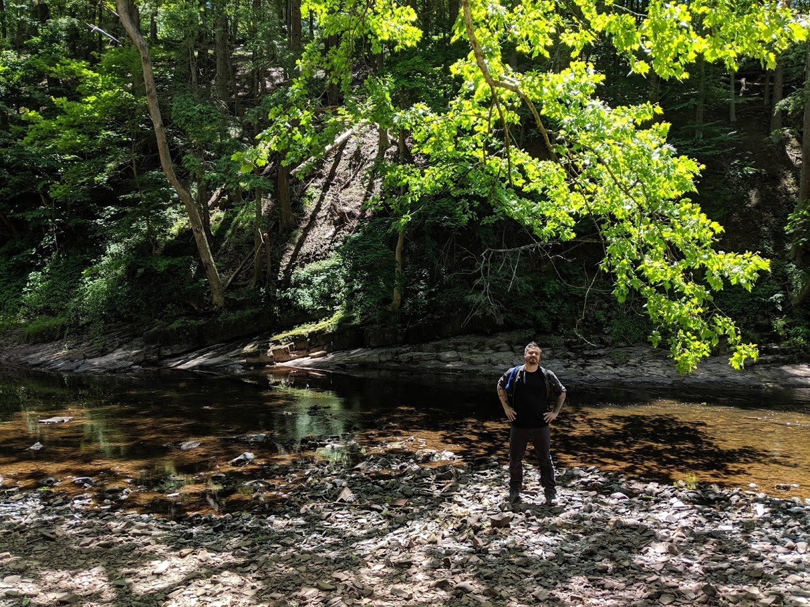
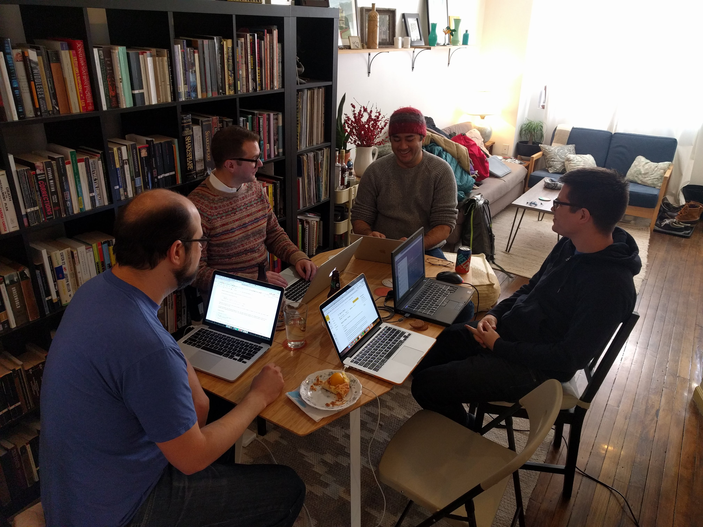

{:class="img-responsive"}

Here's me at Nockamixon State Park a couple weeks ago. Hot weather hiking is the best!

## TODO

### take the AWS Developer Associate exam next Thursday. I got an 81% on my first practice test, so I'm feeling good about it

### keep playing piano this summer

### continue winning my books-over-video-games streak

### start the Unreal Engine tutorial I bought the other day and eventually make some maps for games

### chill and enjoy the rest of the summer</li>

## The [Philadelphia Research and Innovation Group](https://phrig.github.io/") (PhRIG for short) is going strong. Here's a photo of the other PhRIG dudes at a recent meetup -

{:class="img-responsive"}

We recently participated in 2017 [Code4PA Hackathon](https://technical.ly/philly/2017/11/03/final-projects-code4pa-hackathon/) and our project has gotten some attention from the governor's office. Check out [our post](https://phrig.github.io/2018-01-28-cashflow-pa-summary/) on its current status
